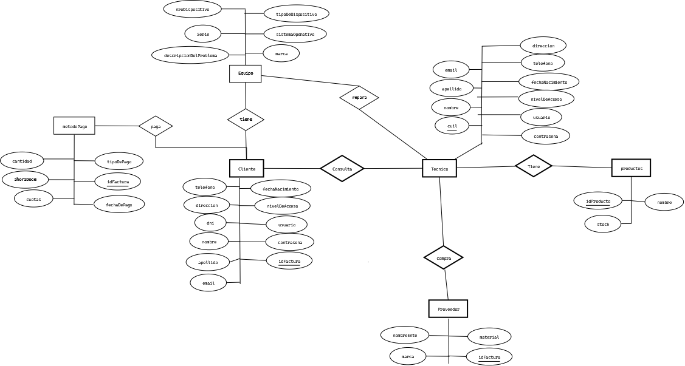
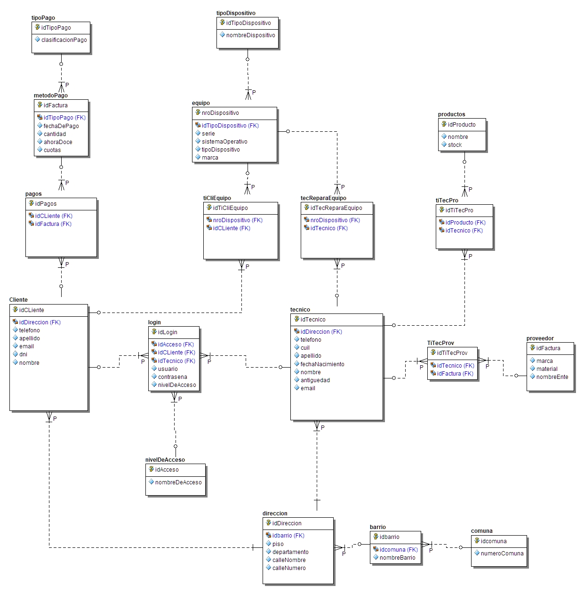

# AdmBaseDeDatos
Proyecto para la materia AdmBaseDeDatos

# Objetivos 
Poder analizar un proyecto real y llevarlo a práctica con un diagrama base de datos con lo visto en clases.
Pensar diferentes manereas de resolver el probelma y darle un enfoque práctico.
Investigar, trabajar en equipo, distribuir tareas.

## Alumnos
Grupo 02 
Alumno | Email |
-------| ----- |
Costas Gonzalo | gonzalo.costas95@gmail.com |
Alberto Canteros |  danyflech@gmail.com |
Paula Amado  |  paulagaamado@gmail.com |
Ezequiel Quispe | ezequiel.q168@gmail.com |
Cesar Santiago Andrés Conde | cesarsantiagoconde@gmail.com|

# Sistema Elegido 
Se quiere desarrollar una base de datos para una __empresa reparación técnica__.

# Relevamiento
Una empresa reparadora de celulares y computadoras nececita una base de datos 
El cliente consulta la reparación del dispositivo que lleva en caso de poder repararlo el receptor le hace una factura, y le comunica al tecnico que hay un nuevo dispositivo a reparar, cada mes hay control de los productos que consume el tecnico,en caso de nececitar reparación se los compra a un proveedor. El tecnico informa cuando no hay stock de materiales, para comprarle al proveedor.
La factura se puede cobrar por efectivo, tarjeta, tranferencias.
# Análisis del Sistema
El análisis del sistema nos sirve para hacer el análisis de requerimientos para saber en el ambiente que vamos a trabajar.

# ER
Diagramamos nuestro diagrama Entidad-Relación de acuerdo al análisis de requerimientos.

# MER
Diagramamos el Modelo de Entidad-Relación, y normalizamos hasta __3FN__ 

# Diccionario de datos
(./DD/DD.md
