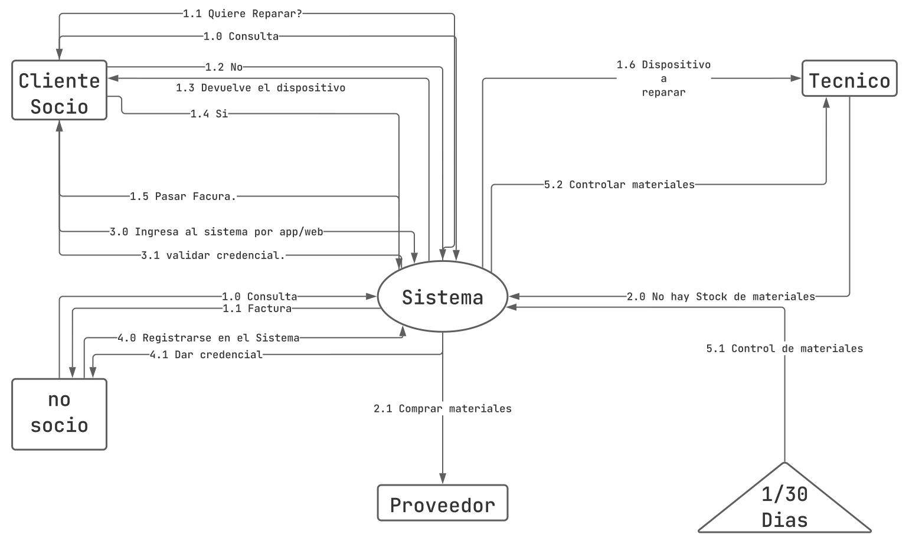

# AdmBaseDeDatos
Proyecto para la materia AdmBaseDeDatos

# Objetivos 

## Alumnos
Grupo 02 
Alumno | Email |
-------| ----- |
Costas Gonzalo | gonzalo.costas95@gmail.com |
Alberto Canteros |  danyflech@gmail.com |
Paula Amado  |  paulagaamado@gmail.com |
Ezequiel Quispe | ezequiel.q168@gmail.com |
Cesar Santiago Andrés Conde | cesarsantiagoconde@gmail.com|

# Sistema Elegido 
Se quiere desarrollar una base de datos para una __empresa reparación técnica__.

# Relevamiento
Una empresa reparadora de celulares y computadoras nececita una base de datos 
El cliente consulta la reparación del dispositivo que lleva en caso de poder repararlo el receptor le hace una factura, y le comunica al tecnico que hay un nuevo dispositivo a reparar, cada mes hay control de los productos que consume el tecnico,en caso de nececitar reparación se los compra a un proveedor. El tecnico informa cuando no hay stock de materiales, para comprarle al proveedor.
La factura se puede cobrar por efectivo, tarjeta, tranferencias.
# Análisis del Sistema

